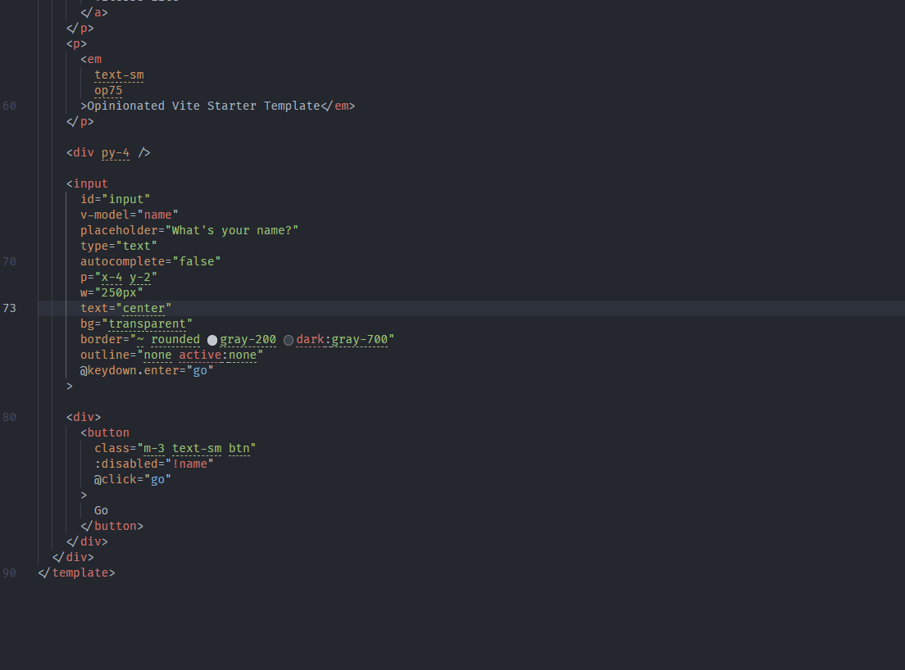

# html-entities-converter

## 功能 Features

右键菜单替换选中部分的 HTML 实体字符 
<p align="center">
  
</p>
<!--  -->

### 自定义配置 Custom configuration

默认配置 - Default config
```json
{
  "<": "&lt;",
  ">": "&gt;",
  "&": "&amp;",
  "\"": "&quot;",
  "'": "&#39;",
  "`": "&#96;",
  " ": "&nbsp;",
  "\t": "&nbsp;&nbsp;&nbsp;&nbsp;",
  "\n": "<br>"
}
```

在`setting.json`增加`html-entities-converter.overrides`字段
键为字符，值为替换后的字符

Add more by add `html-entities-converter.overrides` in `setting.json`

```json
{
  "html-entities-converter.overrides": {
    "&": "&amp;"
  }
}
```
